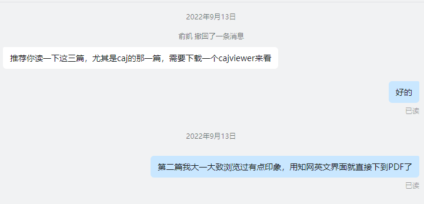

计算机书法的走向问题
目前计算机书法主要的研究方向有：书写工具建模的高效化、精细化；利用计算机进行书法的分析与处理，比如书法图像去噪技术的精进；计算机进行书法的合成与美化，例如，根据书法的美学规则，自动地调整笔画之间的空间关系。
上述的所有技术方向，是在保持书法本身原封不动、无条件接受书法本身设定的前提假设之下的，例如，书写工具的建模，力图还原毛笔在宣纸上写字的效果，然而我们应当看到，毛笔和纸，甚至是汉字，只是书法形成的偶然的因素，并不是不可或缺的，当然我不是否认它们在传统书法里绝对的地位，我所否认的，忽略其它的可能性而自我束缚、忽略其它发展方向的技术研究大方向。
让我们假设，我们完善了当前的所有技术，而当前所有技术似乎是以对草书或生僻的大篆的掌握为天花板的。好了，先从合成书法出发。假设实现了一个模型，可以生成技巧上、视觉上无懈可击的草书作品。然而，受众本身还只是书法圈层里的人，普通人根本没有心思和闲心去学习草法，尽管我们可以迅速地在草书的每个字的角落标注其原字以及标准化、工整化的草书形态协助人们理解但人们过于懒惰与忙碌。此时，草书自动生成系统成为当代的“草圣”，它所带来的，是给人们的临摹样本，更丰富和详细的教学资源，让草书更容易走向大众。同样地，移动端可以实现随时随地的书法学习以及创作，只需要开启手机前置摄像头，手机立在手前，便可以操纵移动端里的毛笔随心所欲地创作，所有移动端的虚拟书写工具可以根据个人喜好而更改属性，大众创作出美好的书法作品更容易、得心应手了。而书法分析处理技术，将所有的笔法、书写工具特质、书法作品的完美修复图揭示给人类，所有字的检索轻而易举，学习书法的条件前所未有的完美。而标准化的美术字体得到空前的美化，更美观的字体而不是微软雅黑、华文行楷等占用人们的视觉。人们以极低的成本获得符合自己个性的字库，所有分配到字体设计上的精力得到了解放。此时，书法进入了全新的生产阶段，源源不断地、每时每刻都能产出媲美二王顶尖书法作品。
我们将技术成熟并落地的硕果分为两类，从人本身的境遇改变出发总结：一，被动地，所处的环境的字体更加美观，潜移默化地影响人的心境，愉悦身心，类似于建筑；二，主动地，更容易习得书法奥秘而发挥创造进入心流，或是信手拈来中意的字体为己所用。
然而问题是，创造欲本身，或是更浅层地，对于艺术的热情，能否被激发？当下，我们有幸随时随地可以听到音乐，可以根据风格查找歌曲，可以随意切换、回退音乐，然而又有谁真正爱音乐，能够潜心欣赏音乐而不是仅将其当作解闷的方式接受算法推荐的简单优美的旋律？我们在闲暇时间愿意刷短视频无限放纵窥视欲、满足猎奇心，还是阅读电子书享受更高层次的趣味？当然，计算机书法的技术成熟，能够给书法爱好者带来很多福利，有助书法的推广教育（最主要地是在中小学）培养更大的书法群体。这本身是值得庆幸的事情，但是，事情没有到此为止。
先从书法的未来演化讲。书法本来是文人自恋的艺术，早期精英阶层通过书信来往在“不经意”间通过书写的字凸显自己的格调满足虚荣心，而当代书法与交流基本是分道扬镳了。我们日益与计算机联系紧密，书法本身也要向计算机迁移，其扎于宣纸、汉字等等的根迟早要被拔起，它迟早要进行进化，因为它的本质是依附于汉字的抽象主义绘画。绘画与文字，一者是视觉的，另一者是语言的。传统书法的魅力在于文本语境、视觉韵律、创作状态等等的交织，但它们并不是密不可分的，比如，公告或墓碑上的书法就没有文本语境参与魅力的建构。而当代，追求效率，我们要让文字排版紧凑、清晰易认，除去部分情况下吸引阅读兴趣的情况，关于行草的计算机书法的至高技术，甚至成为阻碍阅读的技术。传统的书法，包含了汉字构成信息、文本信息以及图像的信息。文本信息本身从艺术角度看，只是给书法本身锦上添花而不是关键的因素——而唐突地给一段文本加上图像信息更是有所企图——比如用雄强、红色的字体更好激起民众情绪。总地，书法将取图像属性和汉字构成信息从文本信息独立出来，更加具体地，书法在表意上借助或增强文本，但文本并非其所必须。而之所以未抛弃汉字构成信息，是因为地球上有十几亿的人使用这独特而耀眼的绘画性文字而基于它有许多风格各异的书法数据，研究表明了关于文字的学习特别是方块字的记忆十分依赖于书写，亿人掌握这种信息，而又有与此信息联系紧密的沉淀千年的传统书法艺术作为民族的遗产，其造型可以发挥建筑一样与人们对话的能力，至少在很长一段时间里，还会有许多基于汉字的书法满足人们的需求。当然，纯粹的书法艺术是脱离文字的，在传统书法里脱离文字是抽象线条表现艺术，计算机将在纯粹书法的发展中扮演重要角色，汉字构成信息的抛弃与否，是视具体境况而定的，例如作为建筑的装饰，就没必要包含完整的汉字构成信息，避免作为辐射文本意义的个体的出现造成信息的冗余。文本信息与书法的分离，造成书法行为本身独立出来——创造书法的自悦自足属性更加凸显了而其炫耀属性被隐蔽了，而为了满足这个需求，书法本身需要配合人们，即，更容易地为人们掌控而不是圈层化、神秘化技巧等。
其次，上文所谓的技术成熟所带来的对书法本身的价值并没有特别大甚至会导致创造欲的枯竭。在我看来，最多，如果没有更多的发展，书法最多成为类似流行音乐的精神消费品。书法走向大众是好事但休想成为大众的主业。大部分人有工作而且现在工作压力很大，对于书法，即便在所有技术成熟了，要么，在闲暇时刻逛逛移动端里的“书法展” 降低血压；要么，购买某个移动端书法软件的包月会员随时随地进入书法家的心流、陶冶情操——而对书法这在生活中扮演调味料的角色有何种能与对流行音乐区别开来的热情呢？而且，计算机造型技术达到顶峰、海量的顶尖书法被生产出来最终过剩的后果是书法本身的贬值。
我并不是否认完善各类书法技术的重要意义，而是想要指出拓展书法表现域的同样的必要性，况且拓展书法表现域的技术并不与现在的大致研究方向划分开来。计算机书法可以做的不仅仅是模拟、合成、美化等等以传统书法为基准的工作，它可以更新传统，例如当今有人例如“薄烟”做的给书法进行立体建模，或是将其与室内设计融合，抑或是生成结合音乐、运镜等拍摄艺术的书法视频，甚至是简易地根据形态选择字创作书法而不是由本身与整体视觉呈现无关的文本来决定哪些字要构成整个视觉要素从而达到更佳的效果。
当有了更多的书法的表现域，人们有更多的选择权、发挥想象力的空间，当书法的表现形式本身可以被人们主动选择而不是书法遗留的传统选择人们，我们才可以说它是有生命力的。而赋予书法生命，是计算机书法应该做的。
数字书法创作的期望
数字平台上的书法创造，输入的设计是核心问题。
首先，如果输入的目的是仿真，那么数字书法创作平台只能成为现实书法创作的无谓的附庸且适合有传统书法基础的人。正如用键盘模拟钢琴或吉他等乐器所暴露出的问题，无法从心所欲、发挥所有技巧，因为所有的演奏技巧是基于传统的乐器的，而演奏的过程是和乐器交流的过程，乐器根据人的输入反馈其物理性质。书法是同样的道理，它的笔法就是和笔的交流，而笔法的输出是线形状，执笔悬空的运动是笔势（根据沃兴华），笔势和“先在”的汉字结构经验决定笔画的分布。笔法、笔势所依是手对笔毫弹性、笔锋位置、笔的重力等等的掌握，而且书法本身也在不断由实用书写和工具塑形，比如，收尾笔法往往是为了让笔锋保持尖聚从而方便书写；隶书末尾的波挑（根据邱振中），是为了书法时手的舒适；王羲之行书手札如《丧乱帖》的奇雄，是因为笔毫的坚硬，后世的线条没有如此复杂的变化是因为制笔法的失传。毫无疑问，至少，在仿真为目的的前提下，数字书法难以重现真实书写的感觉，既然如此，那么学习者难以领会真正的用笔、创作者需要磨合并受到了限制。相比之下，除非将数字书法平台的实用性发挥到极致，与传统书法创作方式相比没有太大竞争力。
其次，既然我们不追求仿真——当然不意味着抛弃所有的书法的现实经验——而是追求另辟书法的创作道路，我们如何另辟？ 
先来比较书法和西方音乐随技术进步的不同发展。根据王兆谷所述，随着录音技术的诞生，西方音乐出现了“具体音乐”作为音乐史巨大的变革，在乐器时代，人们通过发声体（乐器）间接地操纵音乐，而在录音技术出现后，音乐通过信号表示，成为人们能够操纵的声音客体，人们得以随意地创造任何想要的声音，甚至是超过人耳的精密度的声音。在以前，乐器的不断进步发展也都是以人更好操纵为核心。而中国的书法，就一直是围绕保持基本性质的朴素的书写工具而发展出一系列技巧和形式的，如明代造纸术进步促进了大字发展，其它的则是制度、社会现实等影响为大，如碑学的诞生受清代限制言论导致的考据学、金石学的发展的促进，当代书法巨幅化得益于室内空间的扩大。今日，我们的主要书写工具为硬笔，即，真正意义上的书法（根据于忠华）存在于硬笔书写中，然而硬笔书法一直处于被边缘化的状态，也就是，随着传统书写工具的消亡，书法不能从消亡的书写工具中独立出来，尽管硬笔有区别于软笔的线条表现能力与质感。而图像表示与处理、数字绘画技术发展成熟，书法本身除了风格其它没有明显的变动。书法和西方音乐境遇区别的原因在于：一，书法的输出把输入形象化，而音乐是通过抽象输入映射得到声音，一者在传达信息中顺便表达，另一者目的是纯粹的表达；二，音乐是通过不断精进乐器来提高对声音的把控，而书法是把器具作为既定条件，模仿追逐前人的技巧。让我解释一下：一，因为依赖书写，有书写才有书法，所以一开始书法不是特定的追求目标，而由于汉字的构造、工具的性质，它的绘画性凸显出来，它是对运动的形象表现，即一开始作为传达信息的方式的书写的状态，而音乐一开始就是被追求的目标，行动是为了音乐而无其它；二，由于农耕社会厚古、书法作为教化手段、制笔法的失传以及书法保留的有限性，前人技法被神秘化和第一点书法的形象在传达过程中显现，思维被固化于技法练习，追求目标被限制学习在前人留下的有限的造型、并在其基础上出新，而音乐（乐器演奏）本身所追求的音乐是变幻无穷的，而且无留下的模范可追求，需要追求的仅是改进乐器增强对于音乐的把握。比较书法和西方音乐的发展路径，我们可以得出：一，书法本身的发展受到了的历史原因和思维的禁锢，即将它与当下有的书写工具捆绑、把追求方向限制在古人——越古越好，（从书法发展的本身来看确实是一代不如一代，原因就是书法越来越为艺术而艺术）；二，我们应当追求对于线条的掌控力的提高、拓展书法的表现域而不是顽固于笔法上，应像西方音乐学习，不断改良乐器而不是守着乐器苦苦琢磨技巧。当然，不是学西方音乐就万事大吉了，西方音乐特别是具体音乐，遇到的困境是缺乏统一的评价标准。法国音乐哲学家皮埃尔·舍费尔预言过，随着技术的进步，所有的声音将被纳入音乐中。确实，许多被传统音乐排除在外的“噪音”即辅音，纷纷被作曲家利用，也确实有许多成功的案例，但是渐渐地整类音乐遇到了方向问题，正如瓦列兹所感叹的，抛去所有技术所赋予的虚伪的正当性，音乐本身是迷茫的。伟大的舍费尔总结道：艺术的本质应该回归到人本身。我们可以看到，当电子音乐的精密超过了人耳所能感知、音乐的构成超过了人所能理解感悟，它开始向下适应人类的辨识能力。而以人为中心的最终发展结果是“人们的体验和审美判断就不再被‘为艺术而艺术’所约束，而是作为人类精神活动的显现，美的问题重新包括了感官的体验，技艺的作用回归为了美的目的服务，而不再是技艺本身即为美，由此就否定了由艺术家独裁决定的艺术美的意义，艺术回归了人与人之间的抽象表达”。我们完全有颠覆思维定势、超越二王、创造前所未有的书法杰作的底气和能力，而另辟蹊径的方式就是研究发明让我们更好地掌控书法的输入接口。
	既然已经确定了研究的方向，我们该如何设计？如何打造能和现实毛笔相媲美的输入工具？工具如何和使用者交互？在深入细节前，我们还要探究一个问题：更好地掌控书法，意味着掌控哪些？
		首先，最易想到的是对于线条形状的掌控，此为较形象具体而易于想象的。
	其次，书法还包括了章法、字的间架结构、字和字之间的连带等等，我在此统称为组合问题，并且包含择字、伪字。择字是考虑整体作品视觉呈现而选择汉字作为构成元素，伪字是在书写上与汉字类似的符号。那么，如何掌控？暂时的方案是在书写外调整。
	上述两点是对于传统书法的要素控制，我们以锦上添花为意图，考虑一些拓展。谷文达曾利用纵深将字的上下切为两部分，让人惊叹其视觉冲击、体验到压迫胸口的窒息感；某3D游戏里的指示黄线爬在室内墙壁，玩家看着它走动跟随，感到其极富动态与活力。所以我相信纵深和环境是值得探索的方向。

